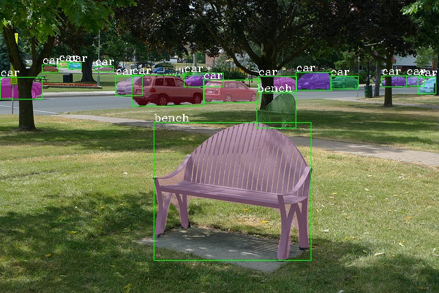

#AParC-DETR: Accelerate DETR training by introducing adaptive position aware circular convolution
>Ya'nan Guan, Shujiao Liao, Wenyuan Yang
>
>Minnan Normal University

## 📰 Abstract

DEtection TRansformer (DETR) is a detection paradigm that views
object detection as a direct set prediction problem, eliminating artificial
designs and interventions to become a more concise approach. However, it is difficult for previous DETR models to obtain local sensitive
positions while processing global information of images, which leads to
slow convergence and poor adaptability during training. In this article,
we introduce the Adaptive Position Aware Circular Convolution DEtection TRansformer (AParC-DETR), which has a global receptive field
and can perceive sensitive local features, improving the model’s adaptability while limiting the increase in computation. Firstly, to complete
the encoding task, content vectors are generated by sampling granule
groups from the three-dimensional space constituted by multi-scale feature maps. Secondly, the content vector and positional vector are updated
through Multi-Head Self-Attention with Boundary Information. Then,
the channel and spatial features are mixed through Adaptive Position
Aware Circular Convolution Global Mixing to obtain the mixed feature
matrix. Adaptive Gating Channel Mixing is incorporated with a gate control branch to improve adaptability while limiting computational costs.
In addition, Position Aware Spatial Mixing extends the receptive field to
the global level with lower computational cost, using instance kernels and
position embedding strategies. Finally, bounding boxes and categories are output to generate detection results. On the MS COCO dataset, AParCDETR achieves an AP of 44.2 after 12 epochs of training, which improves
to 45.8 after 36 epochs. In addition, ablation experiments are conducted
on urban Cityscapes dataset to evaluate the capability of the model
in complex scenes and facilitate the selection of optimal parameters.

## ✨ Highlights
### 🆕 AParC-DETR
We propose AParC-DETR a fresh pipeline that integrates global receptive
fields and local positional awareness to enhance its ability to process the
information in images.

### 🆕 AGCM and PASM
AParC-DETR includes the AGCM and PASM modules. AGCM improves
adaptability while limiting computational complexity. PASM expands the
receptive field to the global level using instance kernels, position embedding
strategies, and parallel structures.

### 🆕 Experiment Result

Empirical results have shown that this architecture achieves better detection 
performance and faster convergence speed on widely adopted bench marks such as
 MS COCO and Cityscapes datasets.

## ➡ Guide to Our Code

Our code structure follows the MMDetection framework. To get started, please refer to mmdetection 
doc [get_started.md](docs/get_started.md) for installation. AParC-DETR's code is built on AdaMixer. 
Thank you AdaMixer for inspiring our creation.

```
@inproceedings{adamixer22cvpr,
  author    = {Ziteng Gao and
               Limin Wang and
               Bing Han and
               Sheng Guo},
  title     = {AdaMixer: A Fast-Converging Query-Based Object Detector},
  booktitle = {{CVPR}},
  year      = {2022}
}
```


Our AParC-DETR config file lies in [configs/adamixer](configs/adamixer) folder. 
You can start training our detectors with make targets in [Makefile](Makefile). 
We have adapted this document.

The code of a AParC-DETR decoder stage is in
[mmdet/models/roi_heads/bbox_heads/adamixer_decoder_stage.py](mmdet/models/roi_heads/bbox_heads/adamixer_decoder_stage.py).
The code of the Granule Group Sampling Encoder is in [mmdet/models/roi_heads/bbox_heads/sampling_3d_operator.py](mmdet/models/roi_heads/bbox_heads/sampling_3d_operator.py).
The code of the Adaptive ParC Global Mixing is in [mmdet/models/roi_heads/bbox_heads/adaptive_mixing_operator.py](mmdet/models/roi_heads/bbox_heads/adaptive_mixing_operator.py).

Due to the use of the MMDetection framework, we did not change the original file name. But for the code in the file, we made some innovations.


## 🧪 Main Results

|  detector | backbone  | epochs | AP | AP_50 |  AP_75 | AP_s | AP_m | AP_l |
| :-------: | :------:  | :---: | :----: | :----:  |:----:  |:----:  | :----:  | :----:  |
| AParC-DETR   |  R50   |  12  | 44.2 |62.8| 47.9| 26.3 |46.9 |59.5| 
| AParC-DETR   |  R50   |  36  |  45.8| 64.5| 49.7| 28.4 |48.4 |61.1|

## ✏ Citation

Thanks to MMDetection, a convenient development architecture.

```
@article{mmdetection,
  title   = {{MMDetection}: Open MMLab Detection Toolbox and Benchmark},
  author  = {Chen, Kai and Wang, Jiaqi and Pang, Jiangmiao and Cao, Yuhang and
             Xiong, Yu and Li, Xiaoxiao and Sun, Shuyang and Feng, Wansen and
             Liu, Ziwei and Xu, Jiarui and Zhang, Zheng and Cheng, Dazhi and
             Zhu, Chenchen and Cheng, Tianheng and Zhao, Qijie and Li, Buyu and
             Lu, Xin and Zhu, Rui and Wu, Yue and Dai, Jifeng and Wang, Jingdong
             and Shi, Jianping and Ouyang, Wanli and Loy, Chen Change and Lin, Dahua},
  journal= {arXiv preprint arXiv:1906.07155},
  year={2019}
}
```


## Original MMDetection README.md
_The following begins the original mmdetection README.md file_
<div align="center">
  
</div>

**News**: We released the technical report on [ArXiv](https://arxiv.org/abs/1906.07155).

Documentation: https://mmdetection.readthedocs.io/

## Introduction

English | [简体中文](README_zh-CN.md)

MMDetection is an open source object detection toolbox based on PyTorch. It is
a part of the [OpenMMLab](https://openmmlab.com/) project.

The master branch works with **PyTorch 1.3+**.
The old v1.x branch works with PyTorch 1.1 to 1.4, but v2.0 is strongly recommended for faster speed, higher performance, better design and more friendly usage.



### Major features

- **Modular Design**

  We decompose the detection framework into different components and one can easily construct a customized object detection framework by combining different modules.

- **Support of multiple frameworks out of box**

  The toolbox directly supports popular and contemporary detection frameworks, *e.g.* Faster RCNN, Mask RCNN, RetinaNet, etc.

- **High efficiency**

  All basic bbox and mask operations run on GPUs. The training speed is faster than or comparable to other codebases, including [Detectron2](https://github.com/facebookresearch/detectron2), [maskrcnn-benchmark](https://github.com/facebookresearch/maskrcnn-benchmark) and [SimpleDet](https://github.com/TuSimple/simpledet).

- **State of the art**

  The toolbox stems from the codebase developed by the *MMDet* team, who won [COCO Detection Challenge](http://cocodataset.org/#detection-leaderboard) in 2018, and we keep pushing it forward.

Apart from MMDetection, we also released a library [mmcv](https://github.com/open-mmlab/mmcv) for computer vision research, which is heavily depended on by this toolbox.

## License

The mmdetection project is released under the [Apache 2.0 license](https://github.com/open-mmlab/mmdetection/blob/master/LICENSE).

## Changelog

v2.12.0 was released in 01/05/2021.
Please refer to [changelog.md](docs/changelog.md) for details and release history.
A comparison between v1.x and v2.0 codebases can be found in [compatibility.md](docs/compatibility.md).

## Benchmark and model zoo

Results and models are available in the [model zoo](docs/model_zoo.md).

Supported backbones:

- [x] ResNet (CVPR'2016)
- [x] ResNeXt (CVPR'2017)
- [x] VGG (ICLR'2015)
- [x] HRNet (CVPR'2019)
- [x] RegNet (CVPR'2020)
- [x] Res2Net (TPAMI'2020)
- [x] ResNeSt (ArXiv'2020)

Supported methods:

- [x] [RPN (NeurIPS'2015)](configs/rpn)
- [x] [Fast R-CNN (ICCV'2015)](configs/fast_rcnn)
- [x] [Faster R-CNN (NeurIPS'2015)](configs/faster_rcnn)
- [x] [Mask R-CNN (ICCV'2017)](configs/mask_rcnn)
- [x] [Cascade R-CNN (CVPR'2018)](configs/cascade_rcnn)
- [x] [Cascade Mask R-CNN (CVPR'2018)](configs/cascade_rcnn)
- [x] [SSD (ECCV'2016)](configs/ssd)
- [x] [RetinaNet (ICCV'2017)](configs/retinanet)
- [x] [GHM (AAAI'2019)](configs/ghm)
- [x] [Mask Scoring R-CNN (CVPR'2019)](configs/ms_rcnn)
- [x] [Double-Head R-CNN (CVPR'2020)](configs/double_heads)
- [x] [Hybrid Task Cascade (CVPR'2019)](configs/htc)
- [x] [Libra R-CNN (CVPR'2019)](configs/libra_rcnn)
- [x] [Guided Anchoring (CVPR'2019)](configs/guided_anchoring)
- [x] [FCOS (ICCV'2019)](configs/fcos)
- [x] [RepPoints (ICCV'2019)](configs/reppoints)
- [x] [Foveabox (TIP'2020)](configs/foveabox)
- [x] [FreeAnchor (NeurIPS'2019)](configs/free_anchor)
- [x] [NAS-FPN (CVPR'2019)](configs/nas_fpn)
- [x] [ATSS (CVPR'2020)](configs/atss)
- [x] [FSAF (CVPR'2019)](configs/fsaf)
- [x] [PAFPN (CVPR'2018)](configs/pafpn)
- [x] [Dynamic R-CNN (ECCV'2020)](configs/dynamic_rcnn)
- [x] [PointRend (CVPR'2020)](configs/point_rend)
- [x] [CARAFE (ICCV'2019)](configs/carafe/README.md)
- [x] [DCNv2 (CVPR'2019)](configs/dcn/README.md)
- [x] [Group Normalization (ECCV'2018)](configs/gn/README.md)
- [x] [Weight Standardization (ArXiv'2019)](configs/gn+ws/README.md)
- [x] [OHEM (CVPR'2016)](configs/faster_rcnn/faster_rcnn_r50_fpn_ohem_1x_coco.py)
- [x] [Soft-NMS (ICCV'2017)](configs/faster_rcnn/faster_rcnn_r50_fpn_soft_nms_1x_coco.py)
- [x] [Generalized Attention (ICCV'2019)](configs/empirical_attention/README.md)
- [x] [GCNet (ICCVW'2019)](configs/gcnet/README.md)
- [x] [Mixed Precision (FP16) Training (ArXiv'2017)](configs/fp16/README.md)
- [x] [InstaBoost (ICCV'2019)](configs/instaboost/README.md)
- [x] [GRoIE (ICPR'2020)](configs/groie/README.md)
- [x] [DetectoRS (ArXix'2020)](configs/detectors/README.md)
- [x] [Generalized Focal Loss (NeurIPS'2020)](configs/gfl/README.md)
- [x] [CornerNet (ECCV'2018)](configs/cornernet/README.md)
- [x] [Side-Aware Boundary Localization (ECCV'2020)](configs/sabl/README.md)
- [x] [YOLOv3 (ArXiv'2018)](configs/yolo/README.md)
- [x] [PAA (ECCV'2020)](configs/paa/README.md)
- [x] [YOLACT (ICCV'2019)](configs/yolact/README.md)
- [x] [CentripetalNet (CVPR'2020)](configs/centripetalnet/README.md)
- [x] [VFNet (ArXix'2020)](configs/vfnet/README.md)
- [x] [DETR (ECCV'2020)](configs/detr/README.md)
- [x] [Deformable DETR (ICLR'2021)](configs/deformable_detr/README.md)
- [x] [CascadeRPN (NeurIPS'2019)](configs/cascade_rpn/README.md)
- [x] [SCNet (AAAI'2021)](configs/scnet/README.md)
- [x] [AutoAssign (ArXix'2020)](configs/autoassign/README.md)
- [x] [YOLOF (CVPR'2021)](configs/yolof/README.md)


Some other methods are also supported in [projects using MMDetection](./docs/projects.md).

## Installation

Please refer to [get_started.md](docs/get_started.md) for installation.

## Getting Started

Please see [get_started.md](docs/get_started.md) for the basic usage of MMDetection.
We provide [colab tutorial](demo/MMDet_Tutorial.ipynb), and full guidance for quick run [with existing dataset](docs/1_exist_data_model.md) and [with new dataset](docs/2_new_data_model.md) for beginners.
There are also tutorials for [finetuning models](docs/tutorials/finetune.md), [adding new dataset](docs/tutorials/new_dataset.md), [designing data pipeline](docs/tutorials/data_pipeline.md), [customizing models](docs/tutorials/customize_models.md), [customizing runtime settings](docs/tutorials/customize_runtime.md) and [useful tools](docs/useful_tools.md).

Please refer to [FAQ](docs/faq.md) for frequently asked questions.

## Contributing

We appreciate all contributions to improve MMDetection. Please refer to [CONTRIBUTING.md](.github/CONTRIBUTING.md) for the contributing guideline.

## Acknowledgement

MMDetection is an open source project that is contributed by researchers and engineers from various colleges and companies. We appreciate all the contributors who implement their methods or add new features, as well as users who give valuable feedbacks.
We wish that the toolbox and benchmark could serve the growing research community by providing a flexible toolkit to reimplement existing methods and develop their own new detectors.

## Citation

If you use this toolbox or benchmark in your research, please cite this project.


## Projects in OpenMMLab

- [MMCV](https://github.com/open-mmlab/mmcv): OpenMMLab foundational library for computer vision.
- [MMClassification](https://github.com/open-mmlab/mmclassification): OpenMMLab image classification toolbox and benchmark.
- [MMDetection](https://github.com/open-mmlab/mmdetection): OpenMMLab detection toolbox and benchmark.
- [MMDetection3D](https://github.com/open-mmlab/mmdetection3d): OpenMMLab's next-generation platform for general 3D object detection.
- [MMSegmentation](https://github.com/open-mmlab/mmsegmentation): OpenMMLab semantic segmentation toolbox and benchmark.
- [MMAction2](https://github.com/open-mmlab/mmaction2): OpenMMLab's next-generation action understanding toolbox and benchmark.
- [MMTracking](https://github.com/open-mmlab/mmtracking): OpenMMLab video perception toolbox and benchmark.
- [MMPose](https://github.com/open-mmlab/mmpose): OpenMMLab pose estimation toolbox and benchmark.
- [MMEditing](https://github.com/open-mmlab/mmediting): OpenMMLab image and video editing toolbox.
- [MMOCR](https://github.com/open-mmlab/mmocr): A Comprehensive Toolbox for Text Detection, Recognition and Understanding.
- [MMGeneration](https://github.com/open-mmlab/mmgeneration): OpenMMLab image and video generative models toolbox.